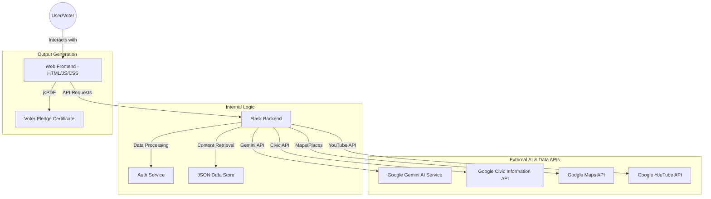
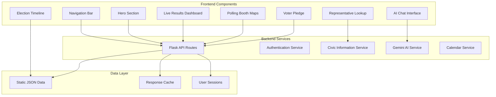
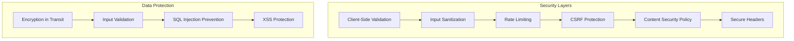
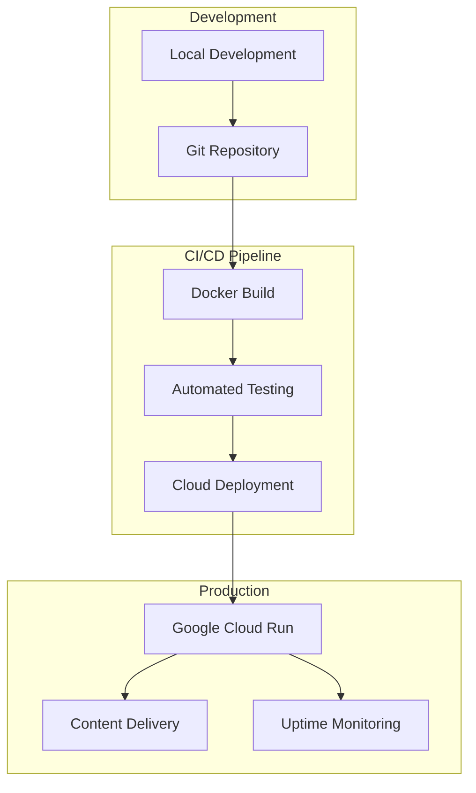
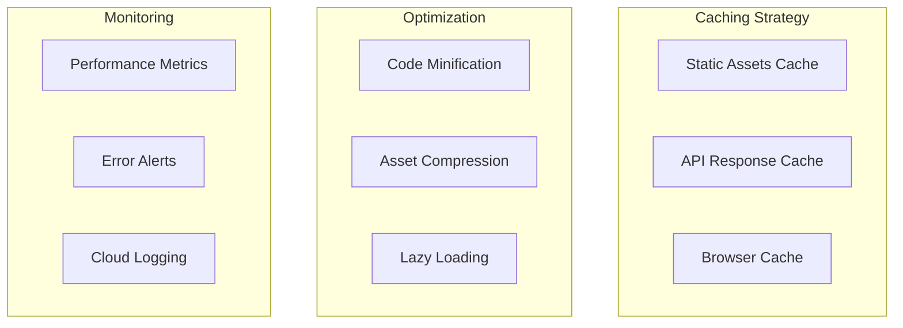
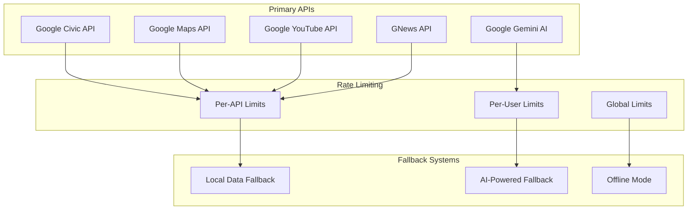
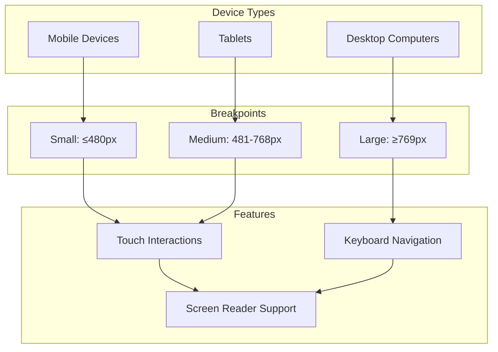

# Electionant System Architecture

Electionant is a modern, AI-powered Single Page Application (SPA) designed to educate and assist Indian voters. This document outlines the high-level architecture and data flow of the platform.

## High-Level Architecture

The application follows a client-server architecture with a Flask backend serving as an API gateway to various high-authority services.

## Core Data Flows

### 1. AI Chat & Assistance
1. User sends a query via the chat interface.
2. Backend sanitizes input and forwards it to the **Gemini AI Service**.
3. Gemini processes the query using election-specific context.
4. Response is returned to the user in real-time.

### 2. Representative & Booth Finder
1. User provides their address or location.
2. Backend queries the **Google Civic Information API**.
3. If specific results are found, they are formatted and displayed.
4. **AI Fallback:** If the API returns no results, Gemini AI is used to provide general constituency information based on geographical data.

### 3. Election Timeline & Results
1. Backend fetches curated election schedules from `election_data.json`.
2. Live results are simulated using high-fidelity datasets representing the 2026 Assembly Election cycle.
3. Frontend renders interactive timelines using `timeline.js`.

## Tech Stack

| Layer | Technology | Purpose |
| :--- | :--- | :--- |
| **Frontend** | HTML5, CSS3, JavaScript (SPA) | User interface with responsive design |
| **Backend** | Python 3.14 / Flask | API server and business logic |
| **AI Engine** | Google Gemini 2.5 Pro | Intelligent chat and fallback assistance |
| **Mapping** | Leaflet.js / OpenStreetMap / Overpass API | Interactive polling booth visualization |
| **Civic Data** | Google Civic Information API | Representative lookup with fallback |
| **PDF Generation** | ReportLab | Digital certificate generation |
| **Authentication** | OAuth 2.0 | Secure user authentication |
| **Styling** | Custom CSS3 | Glassmorphism with mobile-first responsiveness |
| **Deployment** | Docker / Google Cloud Run | Containerized serverless deployment |

## Responsive Design System

**Breakpoints**:
- **Ultra-mobile (≤480px)**: Single-column layouts, 36px touch-friendly icons
- **Tablet (481-768px)**: 2-column grids, optimized spacing
- **Desktop (≥769px)**: Full 4-column grids, enhanced visual hierarchy
- **Landscape (max-height: 600px)**: Condensed hero, optimized navigation

**Design Features**:
- Mobile-first CSS approach with progressive enhancement
- Glassmorphism design with frosted glass effects
- Accessibility-first color contrasts (Saffron, Green, Navy, White)
- Touch-optimized buttons and interactive elements (44px minimum height)
- CSS Grid and Flexbox for responsive layouts

## Component Architecture

## Security Architecture

## Deployment Architecture

## Performance Architecture

## API Integration Architecture

## Responsive Architecture

## Key Features & Enhancements

### Digital Voter Pledge Certificate
- **ReportLab PDF Generation**: Creates professional A4 landscape certificates with centered branding.
- **Branding**: Features authenticated developer signature: *"Signed by Electionant Developer, Debasmita Bose"*.
- **Unique Identifiers**: Each pledge includes a unique Pledge ID for authenticity verification.
- **Logo Integration**: Displays official platform logo at the top of the certificate.
- **Mobile-Friendly**: Certificates are fully responsive and downloadable on all mobile devices.

### Smart Polling Booth Finder
- **Interactive Maps**: Leaflet.js + OpenStreetMap integration for precise polling booth visualization.
- **Responsive Heights**: Optimized for all viewports (500px desktop, 300px mobile).
- **Saffron Branding**: Custom border styling with vibrant gradient backgrounds.
- **Real-time Navigation**: Direct integration with Google Maps for step-by-step directions.
- **Filtering System**: Sidebar with booth listings, filter buttons, and interactive legend.

### AI-Powered Assistance
- **Gemini 2.5 Pro**: Google's latest AI model for high-fidelity civic assistance.
- **Smart Fallback**: AI provides constituency and representative data when primary APIs are limited.
- **Context Awareness**: Specializes in Indian election laws, procedures, and historical data.
- **Real-time Processing**: Sub-second response times for citizen queries.

### Enhanced User Interface
- **Branded Icons**: Lucide icons integrated into FAQ, Privacy, and Terms headers for premium aesthetic.
- **Glassmorphism**: Modern UI with frosted glass effects and high-contrast accessibility.
- **Smooth SPA Navigation**: No-refresh page transitions with persistent preloader state.
- **Mobile-First Footers**: Standardized left-aligned social icons for optimal mobile ergonomics.

### Advanced Mobile Responsiveness
- **Adaptive Grids**: Grids collapse from 4 columns to 1 column on devices ≤480px.
- **Touch Targets**: 40px minimum touch targets and 44px button heights for accessibility.
- **Text Optimization**: Word-wrap and overflow-wrap optimized for small viewports in Insight sections.
- **Footer ergonomic alignment**: Social icons left-aligned with brand text for intuitive mobile use.

### Design System (Glassmorphism)
- **Color Palette**: Saffron (#FF9933), Green (#138808), Navy (#020c1b), White (#f8fafc)
- **Frosted Glass Effect**: Semi-transparent backgrounds with backdrop blur
- **Hover Effects**: Subtle scale and opacity animations (1.1x scale)
- **Consistent Spacing**: 20px base unit for margins and gaps
- **Rounded Corners**: 12-16px border radius for modern appearance

---

## Service Integrations

| Service | Status | Purpose |
| :--- | :--- | :--- |
| **Google Gemini AI** | [Configured] | Intelligent chat and fallback assistance |
| **Google Civic API** | [Configured] | Representative and booth finder |
| **Google Maps API** | [Configured] | Location-based services and navigation |
| **Google YouTube API** | [Configured] | Educational content integration |
| **OAuth 2.0** | [Configured] | Secure user authentication |
| **Google Calendar API** | [Configured] | Election timeline and schedule management |

---

**View License:** [LICENSE](LICENSE) | **Back to README:** [README.md](README.md)
